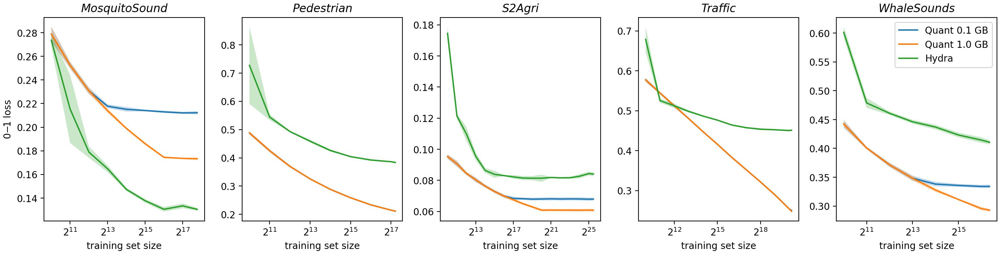
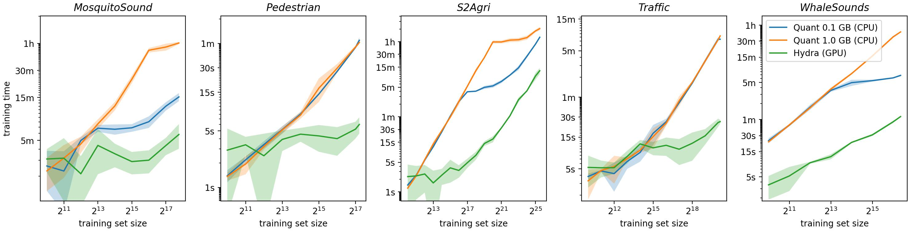

# AALTD 2024

***Highly Scalable Time Series Classification for Very Large Datasets***

> <div align="justify">Relatively little work in the field of time series classification focuses on learning effectively from very large quantities of data. Large datasets present significant practical challenges in terms of computational cost and memory complexity. We present strategies for extending two recent state-of-the-art methods for time series classification&mdash;namely, Hydra and Quant&mdash;to very large datasets. This allows for training these methods on large quantities of data with a fixed memory cost, while making effective use of appropriate computational resources. For Hydra, we fit a ridge regression classifier iteratively, using a single pass through the data, integrating the Hydra transform with the process of fitting the ridge regression model, allowing for a fixed memory cost, and allowing almost all computation to be performed on GPU. For Quant, we ‘spread’ subsets of extremely randomised trees over a given dataset such that each tree is trained using as much data as possible for a given amount of memory while minimising reads from the data, allowing for a simple tradeoff between error and computational cost. This allows for the straightforward application of both methods to very large quantities of data. We demonstrate these approaches with results (including learning curves) on a selection of large datasets with between approximately 85,000 and 47 million training examples.</div>

Please cite as:

```bibtex
@article{dempster_etal_2024,
  author = {Dempster, Angus and
            Tan, Chang Wei and
            Miller, Lynn and
            Foumani, Navid Mohammadi and
            Schmidt, Daniel F and
            Webb, Geoffrey I},
  title  = {Highly Scalable Time Series Classification for Very Large Datasets},
  year   = {2024},
  note   = {9th Workshop on Advanced Analytics and Learning on Temporal Data}
}
```

## Requirements

* Python
* NumPy
* PyTorch
* scikit-learn
* tqdm

## Results


**Fig. 2.** Learning curves (0&ndash;1 loss) for Quant and Hydra.


**Fig. 3.**  Training times for Quant and Hydra.

* Learning Curves
    * [0&ndash;1 Loss](./results/lc_error.csv)
    * [Training Time (Seconds)](./results/lc_time.csv)

* Full Results
    * [0&ndash;1 Loss](./results/results_error.csv)
    * [Training Time (Seconds)](./results/results_time.csv)

## Code

* [`utils.py`](./code/utils.py)

* Hydra
    * [`hydra_gpu.py`](./code/hydra_gpu.py)
    * [`ridge.py`](./code/ridge.py)

* Quant
    * [`quant.py`](./code/quant.py)

## Data Format

Data should be stored on disk in `*.npy` format:
* `X` (time series), `np.float32`, shape `[examples, channels, length]`
* `Y` (labels), `np.int64`, shape `[examples]`

The `Dataset` class (in [`utils.py`](./code/utils.py)) is a thin wrapper around `np.load(..., mmap_mode = "r")`, providing an iterator over memory-mapped `*.npy` files.  (The `BatchDataset` class provides some additional functionality specific to `QuantClassifier`.)

Note: There is an overhead for reading large memory-mapped files in random order.  This overhead is unnoticeable for practical purposes unless the file is quite large (i.e., more than 5 million examples), but can become quite significant.  Quant is sensitive to data ordering, but data can be read sequentially if the underlying data is shuffled on disk.  For these reasons, for Quant in particular, we read the S2Agri dataset (which is already shuffled on disk) sequentially.  (The differences between random and sequential reads should be relatively minor for smaller datasets.)  Hydra is agnostic to data ordering: data should always be read sequentially.

## Examples

### Hydra

```python
import torch
import numpy as np

from utils import Dataset
from hydra_gpu import HydraGPU, HydraMultivariateGPU
from ridge import RidgeClassifier

device = torch.device("cuda" if torch.cuda.is_available() else "cpu")

# == load data =================================================================

filename_X = "Pedestrian_X.npy" # np.float32, shape [examples, channels, length]
filename_Y = "Pedestrian_y.npy" # np.int64, shape [examples]

data = Dataset(filename_X, filename_Y, batch_size = 512, shuffle = False)

indices_te = np.loadtxt("test_indices_fold_0.txt", np.int32)
indices_tr = np.setdiff1d(np.arange(data.shape[0]), indices_te))

indices_te = np.sort(indices_te)
indices_tr = np.sort(indices_tr)

data_tr = data[indices_tr]
data_te = data[indices_te]
data.close()

num_classes = len(data_tr.classes)

# == fit model =================================================================

transform = HydraGPU(input_length = data_tr.shape[-1]).to(device)

model = RidgeClassifier(transform = transform, device = device)
model.fit(data_tr, num_classes = num_classes)

# == score =====================================================================

error = model.score(data_te)

data_tr.close()
data_te.close()
```

### Quant

```python
import numpy as np

from utils import BatchDataset
from quant import QuantClassifier

# == load data =================================================================

filename_X = "Pedestrian_X.npy" # np.float32, shape [examples, channels, length]
filename_Y = "Pedestrian_y.npy" # np.int64, shape [examples]

data = BatchDataset(filename_X, filename_Y)
# data = BatchDataset(filename_X, filename_Y, shuffle = False) # if reading data in sequential order

indices_te = np.loadtxt("test_indices_fold_0.txt", np.int32)
indices_tr = np.setdiff1d(np.arange(data.shape[0]), indices_te)

indices_te = np.sort(indices_te)
# indices_tr = np.sort(indices_tr) # if reading data in sequential order

data_tr = data[indices_tr]
data_te = data[indices_te].unbatch() # test data should not use overlapping batches
data_te._shuffle = False # never need to shuffle test data
data.close()

# == fit model =================================================================

model = QuantClassifier()
model.fit(data_tr)

# == score =====================================================================

error = model.score(data_te)

data_tr.close()
data_te.close()
```